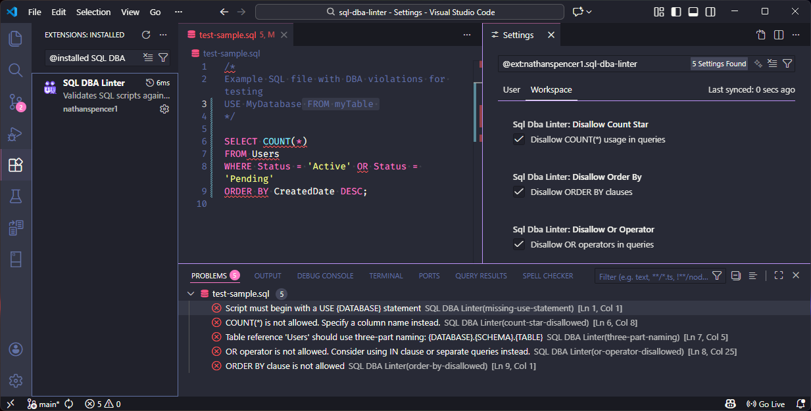

# SQL DBA Linter

A VSCode extension that validates SQL scripts against common DBA rules and best practices.



## Features

- **USE Statement Validation**: Ensures scripts begin with a `USE {DATABASE}` statement
- **Three-Part Naming Convention**: Validates that table references use `{DATABASE}.{SCHEMA}.{TABLE}` format
- **OR Operator Detection**: Flags usage of OR operators
- **ORDER BY Detection**: Flags usage of ORDER BY clauses

All violations appear in the Problems panel and can be navigated using F8 (next error) and Shift+F8 (previous error).

## Configuration

Configure the linter in your VSCode settings:

- `sqlDbaLinter.requireUseStatement`: Require USE statement at script beginning (default: true)
- `sqlDbaLinter.requireThreePartNaming`: Require three-part naming for tables (default: true)
- `sqlDbaLinter.disallowOrOperator`: Disallow OR operators (default: true)
- `sqlDbaLinter.disallowOrderBy`: Disallow ORDER BY clauses (default: true)
- `sqlDbaLinter.disallowCountStar`: Disallow COUNT(*) usage in queries (default: true)

## Installation

### For Development
1. Open this folder in VSCode
2. Run `npm install`
3. Press F5 to launch Extension Development Host

### For Distribution
1. Install vsce: `npm install -g @vscode/vsce`
2. Package the extension: `vsce package`
3. Share the generated `.vsix` file with your team
4. Install via: Extensions view → ... menu → Install from VSIX

## Usage

Open any `.sql` file and the linter will automatically validate it. Errors will appear:
- In the Problems panel (View → Problems)
- As squiggles in the editor
- Navigate with F8 (next) / Shift+F8 (previous)

## Testing

### Running Tests

Run the test suite using:

```bash
npm test
```

This will:
1. Compile the TypeScript code
2. Run ESLint
3. Execute all unit tests in a VS Code test environment

### Running Tests in Watch Mode

For development, you can run tests in watch mode:

```bash
npm run watch
```

Then press F5 in VS Code to launch the test runner.

### Test Structure

Tests are located in `src/test/suite/` and follow the naming convention `*.test.ts`. The test suite uses:
- **Mocha** - Test framework
- **VS Code Test API** - For testing extension code in a real VS Code environment

### Writing New Tests

1. Create a new file in `src/test/suite/` with the suffix `.test.ts`
2. Import the necessary modules and the code to test
3. Use Mocha's `suite()` and `test()` functions to organize tests
4. Run `npm test` to execute your tests

Example:
```typescript
import * as assert from 'assert';
import * as vscode from 'vscode';

suite('My Test Suite', () => {
  test('My test case', () => {
    assert.strictEqual(1 + 1, 2);
  });
});
```
